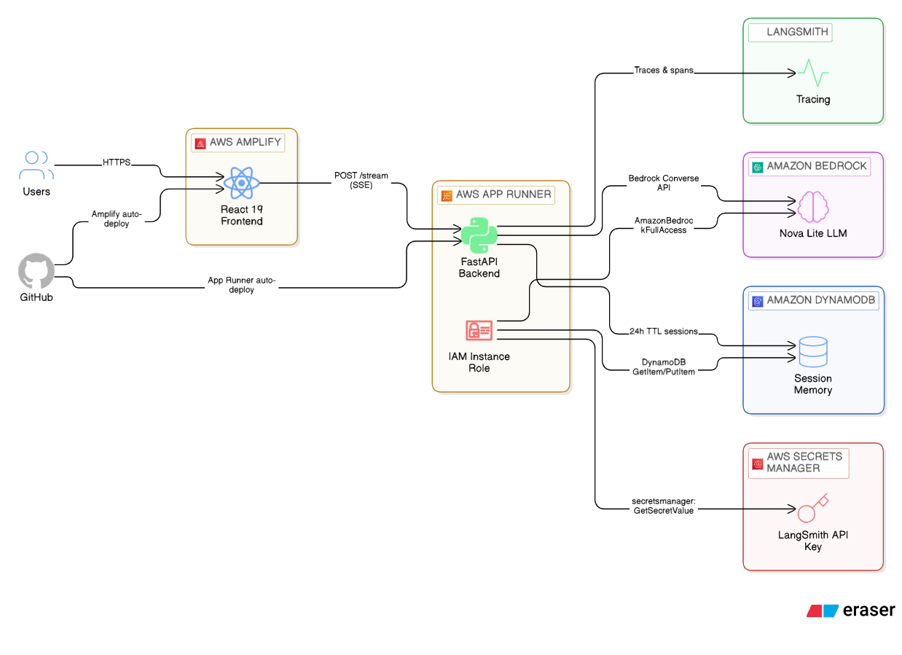
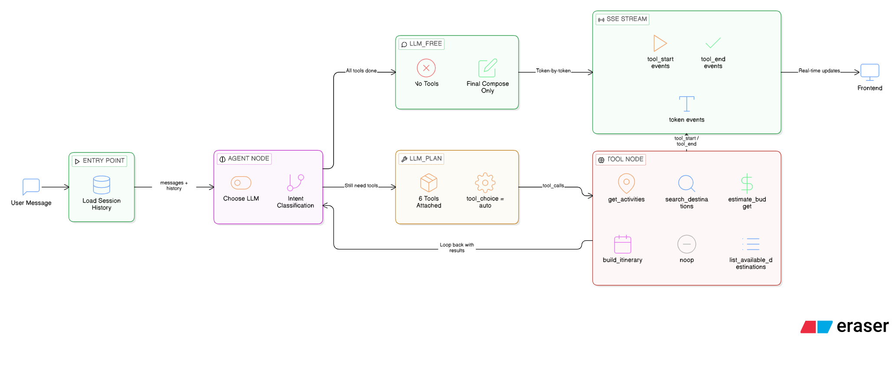

# Trip Planner AI

A conversational AI trip planning assistant for Australian travellers. Ask it anything from "plan 7 days in Japan under A$5,000" to "Tokyo vs Kyoto — which one for a first trip?" and it builds a full day-by-day itinerary, compares destinations, or runs a budget feasibility check — all from a single chat interface.

Live at **[https://main.d2w43whsnkjgdq.amplifyapp.com](https://main.d2w43whsnkjgdq.amplifyapp.com)**

## What it does

The agent works against a curated knowledge base of 22 destinations across Asia, Europe, the Americas, Oceania, and Africa. It detects what kind of question you're asking — full trip plan, destination comparison, feasibility check, or general chat — and routes accordingly. For a full plan it calls four tools in sequence, streaming each step back to the UI as it goes.

Conversation memory is preserved within a session so follow-up messages like "make it 10 days instead" or "swap the beach days for food markets" work correctly.

## Tech stack

| Layer | Technologies |
|---|---|
| Frontend | React 19, TypeScript, Vite, Tailwind CSS |
| Backend | Python 3.11, FastAPI, Uvicorn |
| Agent | LangGraph, LangChain AWS, Amazon Nova Lite via Bedrock |
| Storage | DynamoDB (session history, 24 h TTL) |
| Observability | LangSmith |
| Hosting | AWS App Runner (backend), AWS Amplify (frontend) |

## Architecture



## Agent Loop



## Project structure

```
├── client/          # React + Vite frontend
├── server/          # FastAPI + LangGraph backend
├── amplify.yml      # Amplify build config
├── arch.png         # Architecture diagram
├── agent.png        # Agent loop diagram
└── .gitignore
```

## How the agent works

The backend runs a LangGraph graph with two node types — `_agent_node` and `_tool_node` — that loop until the response is ready.

On each turn `_agent_node` inspects which tools have already been called and classifies the intent:

- **Full plan** — calls `search_destinations` → `estimate_budget` → `get_activities` → `build_itinerary`, then composes the response
- **Comparison** — calls `search_destinations` twice (once per city), then composes a short side-by-side summary
- **Feasibility** — calls `search_destinations` → `estimate_budget`, answers the yes/no budget question directly
- **Greeting / off-topic** — calls `list_available_destinations` (lightweight, always safe), composes a conversational reply without surfacing any destination data

Two LLM bindings are used: `_llm_plan` (tools attached, `tool_choice=auto`) for passes where the model must call a tool, and `_llm_free` (no tools) for the final composing pass so the model cannot accidentally trigger another tool call.

The frontend connects to `/stream` — a server-sent events endpoint — and receives `tool_start`, `tool_end`, and `token` events in real time. The UI shows a per-tool status label while each tool is running and streams the final response token by token.

## Local development

**Prerequisites:** Python 3.11+, Node.js 18+, AWS credentials with Bedrock access to `us.amazon.nova-lite-v1:0` in us-east-1.

```bash
# Backend
cd server
python -m venv .venv
.venv\Scripts\activate       # Windows
# source .venv/bin/activate  # macOS / Linux
pip install -r requirements.txt
cp .env.example .env         # fill in AWS credentials and region
uvicorn main:app --reload --port 8000

# Frontend (separate terminal)
cd client
npm install
npm run dev
```

Frontend runs on `http://localhost:5173`. Vite proxies `/stream`, `/plan`, `/health`, and `/usage` to `http://localhost:8000` so no CORS config is needed locally.

## Deployment

**Backend** — AWS App Runner (ap-southeast-2). Config lives in `server/apprunner.yaml`. App Runner auto-deploys from the `main` branch, installs dependencies, and runs `python3 -m uvicorn main:app --host 0.0.0.0 --port 8080`. An attached IAM role handles Bedrock and DynamoDB access — no credentials stored anywhere. The LangSmith API key is fetched from AWS Secrets Manager at startup.

**Frontend** — AWS Amplify. Config lives in `amplify.yml`. Amplify auto-deploys when the `client/` directory changes. `VITE_API_URL` is set as an Amplify environment variable pointing to the App Runner URL.

## More info

- [Client documentation](client/README.md)
- [Server documentation](server/README.md)
